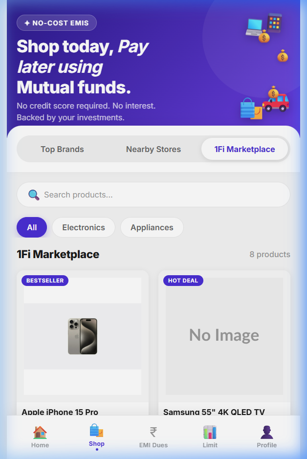
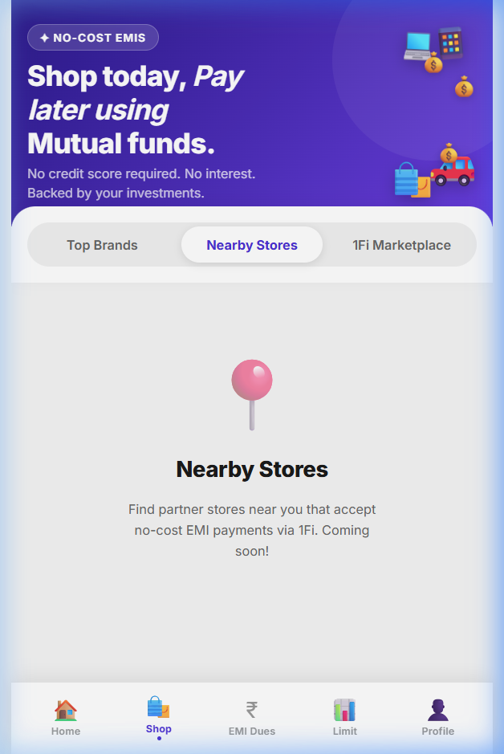
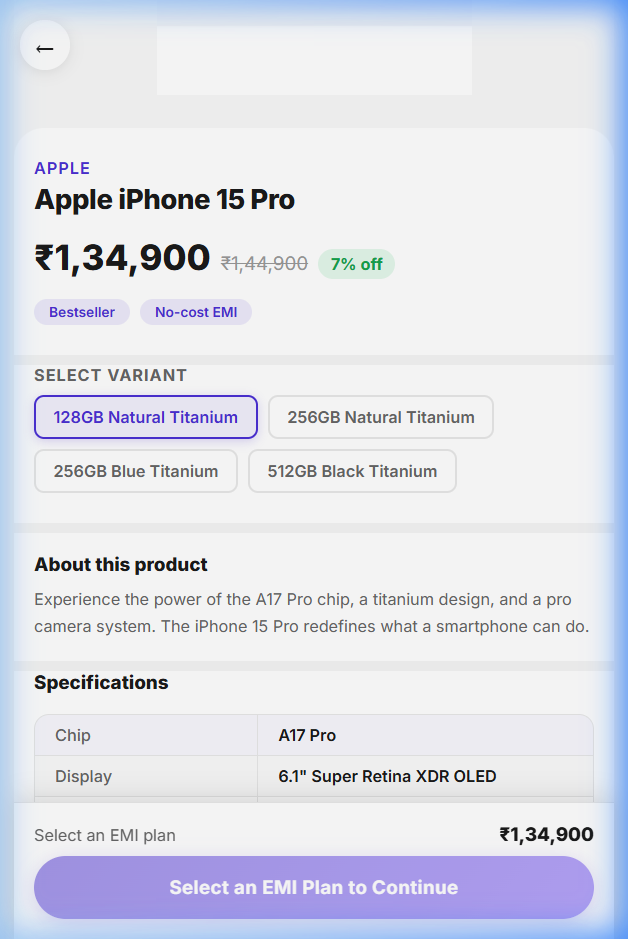
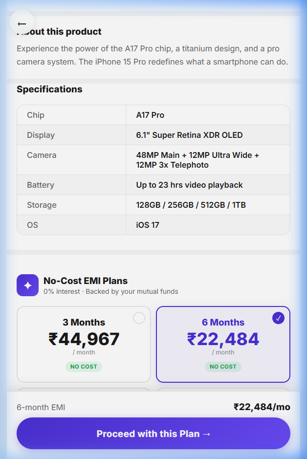

# 1Fi Marketplace – SDE Intern Assignment

A React implementation of the **1Fi Marketplace** section within the existing 1Fi Shop experience, built as part of the SDE Intern assignment.

## Live Demo

> Run locally with the steps below.

---

## Screenshots

| 1Fi Marketplace | Nearby Stores (blank) |
|---|---|
|  |  |

| Product Detail | EMI Plan Selection |
|---|---|
|  |  |

---

## Features implemented

### Shop page
| Tab | Status |
|---|---|
| Top Brands | Blank (as per requirements) |
| Nearby Stores | Blank (as per requirements) |
| **1Fi Marketplace** | ✅ Fully implemented |

### 1Fi Marketplace
- **Product listing** — 2-column responsive grid with skeleton loading state
- **Product detail page** — full-screen view with image gallery and dot navigation
- **Product variants** — selectable chips that update price and EMI plans dynamically
- **No-cost EMI plans** — auto-generated from product price, 3–24 month tenures
- **EMI plan selection** — 2-column card grid with live summary (monthly × tenure + total)
- **Sticky CTA** — updates on plan selection; confirms inline on proceed
- **Search** — client-side filtering by name or brand
- **Category filter** — All / Electronics / Appliances
- **Error & loading states** — throughout the listing and detail flows

---

## Architecture

```
UI
 ↓
components  (ProductCard, EmiSelector, EmiPlanCard, SkeletonCard, ErrorState …)
 ↓
pages       (MarketplacePage, ProductPage)
 ↓
hooks       (useProducts, useProduct)       ← useReducer, no race conditions
 ↓
services    (productApi.js)                 ← swap for real API here
 ↓
data        (products.json)
```

Replacing the mock data with a real backend requires changes only in `src/services/productApi.js`.

---

## Project structure

```
src/
├── components/
│   ├── Layout/
│   │   ├── BottomNav.jsx
│   │   └── HeroBanner.jsx
│   ├── Marketplace/
│   │   ├── EmiPlanCard.jsx
│   │   ├── EmiSelector.jsx
│   │   └── ProductCard.jsx
│   ├── Shop/
│   │   ├── BrandCard.jsx
│   │   ├── SearchBar.jsx
│   │   └── ShopTabs.jsx
│   └── common/
│       ├── ErrorState.jsx
│       └── SkeletonCard.jsx
├── data/
│   ├── emiPlans.js          ← EMI calculation utilities
│   ├── products.json        ← mock product catalogue
│   └── brands.json
├── hooks/
│   └── useProducts.js       ← useProducts() + useProduct()
├── pages/
│   ├── MarketplacePage.jsx
│   ├── ProductPage.jsx
│   ├── ShopPage.jsx
│   ├── TopBrandsPage.jsx    ← blank
│   ├── NearbyStoresPage.jsx ← blank
│   └── HomePage.jsx
├── services/
│   └── productApi.js        ← async API layer (mock)
└── styles/
    ├── index.css
    └── components.css
```

---

## Tech stack

| Tool | Version |
|---|---|
| React | 19 |
| React Router | v7 |
| Vite | 8 |
| Vanilla CSS | — |
| oxlint | 1.79 |

**No TypeScript. No Tailwind. Pure JS/JSX.**

---

## Getting started

```bash
# Install dependencies
npm install

# Start dev server
npm run dev

# Lint
npm run lint

# Production build
npm run build
```

App runs at `http://localhost:5173`.

Navigate to **Shop → 1Fi Marketplace** to see the implemented feature.

---

## EMI model

All EMIs are **no-cost** (0% interest, no processing fees) — consistent with 1Fi's positioning:

```
monthlyAmount = Math.ceil(price / tenureMonths)
totalAmount   = monthlyAmount × tenureMonths
```

Available tenures: 3, 6, 9, 12, 18, 24 months (capped per product via `maxEmiMonths`).
